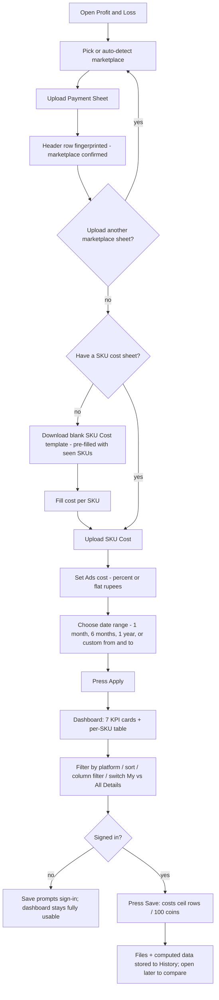
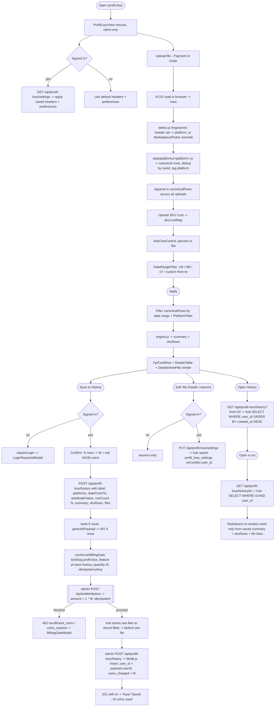

# Feature Development Plan — Profit & Loss Tool (`tools/arshanemi-tools-5`)

> Single source of truth for **arshanemi-tools-5**, a standalone Next.js app
> whose one product is a multi-marketplace **Profit & Loss dashboard** for
> ecommerce sellers. Cloned from `tools/arshanemi-tools-4` with every
> listing surface removed; keeps that app's login / OTP / profile /
> coin-wallet / SSO / theme plumbing.
>
> Author role: **Senior Full-Stack Developer**. Status: **NEW** —
> `tools/arshanemi-tools-5` currently holds only an empty `.git` (remote
> `github.com/arshanemi-dev/arshanemi-tools-5.git`, no commits).
>
> **Rev 2 (2026-09-08)** — incorporates the user's 5 sample CSVs (one per
> marketplace) and the clarifications: single-product navbar; "All Compay" =
> **ecommerce-platform filter** (there is no company entity); **no login to
> use**; logged-in users get their files/data saved and are charged **1 coin
> per 100 rows saved**, deducted on the admin-panel side.

---

## Source studied

| File / area | Contribution |
|---|---|
| [.claude/commands/feature-plan.md](../.claude/commands/feature-plan.md) | The 11-step skeleton, adapted from the AI-Job-Applier/Mongo stack to this repo's Next 16 + JS + Supabase/Postgres + Vercel Blob + JWT-SSO stack. |
| [tools/TOOLS-API-BILLING-GUIDE.md](../tools/TOOLS-API-BILLING-GUIDE.md) | `runBillingGate()` waterfall; `NEXT_PUBLIC_IS_CONNECT` / `NEXT_PUBLIC_IS_PAID` switches; "admin panel is the bank". |
| tools-4 `app/layout.js`, `app/page.js`, `proxy.js`, `.env.example`, `next.config.mjs` | Clone base: anti-FOUC theme script, SSO token forwarding (`lt_at/lt_rt/lt_u`), middleware matcher, env contract. |
| tools-4 `lib/{auth,authGate,connect,db,tokenStore,tokenHandoff,profile,serverBilling,toolBilling,tools}.js` | Every auth/session/billing helper carried over. `serverBilling.js` `runServerBillingGate(req, { toolSlug, featureApiIdentifier, quantity })` → `POST /api/wallet/deduct`. |
| tools-4 `app/api/auth/{login,me,refresh,logout}/route.js` | `if (IS_CONNECT) return proxyAuthCall(...)` branch on every auth route. JWT payload `{ userId, email, role, name, companyId }`. |
| tools-4 `app/api/listing-tools/{history,product-details-history}/route.js` | The "thin proxy to the hub, forward the caller's own token via `authHeaderFrom(req)`" idiom the new `/api/profit-loss/*` routes copy. |
| tools-4 `components/dashboard/{DashboardTopbar,BottomMenu,UserMenu}.jsx`, `context/ThemeContext.jsx`, `components/auth/AuthGateProvider.jsx`, `app/{login,profile,forgot-password,reset-password}/page.js` | Single-product navbar, theme provider, global login modal, account screens — reused. |
| `tools/arshanemi-tools-2/lib/platformDetector.js` | Keyword-fingerprint marketplace detection — model for sheet-header detection here. |
| [app/api/wallet/deduct/route.js](../app/api/wallet/deduct/route.js) | **Confirmed: `quantity` is honoured** — `amount = feature.coinCost * qty`; idempotent on `idempotencyKey`; `master_admin` never charged; checks `tools_access.includes(toolSlug)`. This is what the "1 coin / 100 rows" charge rides on (`coinCost: 1`, `quantity = ceil(rows/100)`). |
| `scripts/{listing_product_prefill_history,sku_mapping,customer_dashboard,listing_template_access}_migration.sql` | Per-user Postgres table pattern (`user_id UUID REFERENCES users(id) ON DELETE CASCADE`, `UNIQUE` business key, RLS "service role manages" policy). |
| `app/api/listing-tools/{history,product-details-history,prefill-details-history}/route.js`, `lib/db.js` (`recordListingTemplateHistory`, `upsertProductDetailsHistory`, …), `lib/auth.js`, `lib/profile.js` | Hub contract: guard with `getAuthPayload(req)` → `payload.userId`; camelCase on the wire; snake_case + explicit mapper only inside `lib/db.js`. |
| `data/tools.js`, `scripts/schema.sql`, `scripts/grant_all_tools_to_all_users.mjs`, `next.config.mjs`, `app/tools/[slug]/page.js` | Catalog-entry shape; `users.id = UUID`; `npm run db:grant-all-tools`; trailing-slash + `redirects()`; the public marketing landing route. |
| **5 user-supplied sample CSVs** — Meesho, Amazon, Flipkart, Myntra, JioMart | The authoritative column schema per marketplace. Fully transcribed in Step 8. |

**Reference design:** the uploaded dashboard screenshot. **Action required:**
save it to `tools/arshanemi-tools-5/source/profit-loss-dashboard.png` and the
5 CSVs to `tools/arshanemi-tools-5/source/samples/{meesho,amazon,flipkart,myntra,jiomart}.csv`
before implementation.

---

## Rules (hard constraints)

1. **JavaScript only** — `.jsx` / `.js`, no TS (repo rule).
2. **Tailwind only** — tokens in `app/globals.css` `@theme {}` (v4, no config file). Reuse tools-4's `globals.css` verbatim.
3. **Clone, don't reinvent auth** — every file marked "carried over" in Step 11(c) is copied byte-for-byte from tools-4 except the listed string edits.
4. **The tool app never touches Postgres** — no `@supabase/supabase-js`. All per-user persistence goes over HTTP to the admin panel via `proxyAdminCall(path, { authHeader: authHeaderFrom(req) })`, exactly like tools-4's `/api/listing-tools/history`. The hub's `lib/db.js` + Supabase service-role client is the only DB writer.
5. **camelCase on the wire, snake_case in the DB** — mapping happens **only** inside admin-pannels `lib/db.js`.
6. **No login to use.** `/profit-loss` fully works with no session: upload sheets, compute, view dashboard, export — 100% client-side, nothing leaves the browser. **Login unlocks persistence:** the user's uploaded files + computed data are saved (History), and column/preference choices are saved (My Details).
7. **Metered save.** For a logged-in user, **saving** costs **1 coin per 100 rows** of parsed data (`Math.ceil(totalRows / 100)` coins), deducted by the admin panel via `POST /api/wallet/deduct` (`coinCost: 1`, `quantity`). Browsing / computing / exporting is always free. Anonymous users can't save and are never charged. App ships `NEXT_PUBLIC_IS_PAID=true`.
8. **Single-product navbar.** The top bar shows only this product — logo, "Profit & Loss", and Log in / account. No links to other tools. (tools-4's `DashboardTopbar` already is this; only the centre label changes.)
9. **Platform-agnostic engine.** `lib/profitLoss/engine.js` only ever sees a **canonical row schema**. Every marketplace quirk lives in one module under `data/platforms/`. A 6th marketplace = one new file, zero engine changes.
10. **400 LOC ceiling; one concern per file** — `page.js` is a thin shell; `components/dashboard/` gets one file per region.
11. **Mobile-first Tailwind** — the details table scrolls inside its own `overflow-x-auto` box; the page body never scrolls sideways.
12. **`export const runtime = 'nodejs'`** on every new API route.

---

### Step 1 — What is the feature

**a. Plain-language description.**
Sellers who list on Flipkart, Meesho, Amazon, Myntra and JioMart each
download a differently-shaped settlement/payment spreadsheet from that
marketplace every payout cycle. Working out *"did I actually make money this
month, and on which SKU?"* means reconciling each of those files against
your own cost sheet by hand. **Profit & Loss** does it automatically: pick
(or let it detect) the marketplace, upload the payment sheet (and optionally
an order sheet), upload a one-time SKU-cost sheet, choose a date range, and
it renders a dashboard — headline numbers (Orders, Returns, Cancellations,
RTO, Ad spend, COGS, net Profit/Loss) and a sortable/filterable per-SKU
table. You can load several marketplaces at once and filter the view by
platform. No account is needed to use it. If you sign in, your uploaded
files and results are saved to a history and your column preferences stick —
saving costs 1 coin per 100 rows.

**b. Source citation.** No `docs/` brief exists. Spec = the user's numbered
brief + the uploaded screenshot + 5 sample CSVs. Verbatim requirements:

> - "same use payments coins login screens and profile everything same just remove listing realted everythings create a base projects"
> - "Navbar for only this products"
> - "In this login no required if user login then uploaded sheets just see all process infrontend sides if users login then he is stored his files and every 100+ data cuts 1 coins saved cut 1 coins in arshanemi admin paneels sides"
> - "All comnpanyt typo erros means exccomerce platforms no compnay creations"
> - "automatic platform detaiections from sheets if possibles"
> - "Create a product page default urls profit-loss/"
> - "In Date filter click open 1 months 6 months 1 years and cuatom custom click from date and to date selectioions"
> - "two tables only one my datils just in thus userId and one json for my heasders list save and 2nd is all history of my data user wise"

**c. Status.** **NEW.**

---

### Step 2 — Pages

App is `robots: { index: false }` (like tools-4).

| Route | File | New / cloned | Type | Purpose |
|---|---|---|---|---|
| `/` | `app/page.js` | modified clone | server | SSO handoff — forward `lt_at/lt_rt/lt_u`, then `redirect('/profit-loss')`. |
| `/profit-loss` | `app/profit-loss/page.js` | **NEW** | thin server shell → client `<ProfitLossView/>` | The whole tool: toolbar (marketplace picker + 4 upload/download buttons), KPI card row, per-SKU details table, date-range filter, platform filter, "My Details" / "All Details" column pills, History drawer, Save. Pixel-matched to `source/profit-loss-dashboard.png`. |
| `/login` | `app/login/page.js` | cloned (copy tweaks) | client | Email/mobile + password, OTP 2nd step for `master_admin` / `otp_enabled`. `next` defaults to `/profit-loss`. |
| `/profile` | `app/profile/page.js` | cloned verbatim | client | Self-service account + wallet balance. |
| `/forgot-password`, `/reset-password` | cloned verbatim | client | OTP password reset. |
| `robots.js`, `sitemap.js` | cloned | — | `disallow: '/'`. |

No `error.tsx`/`loading.tsx` triad — tools-4 has none (no shared primitives);
`<ProfitLossView/>` renders its own inline skeleton.

**b. Public marketing page (separate repo).**
`barmeto.com/tools/profit-loss` is served by the existing
[app/tools/[slug]/page.js](../app/tools/%5Bslug%5D/page.js) once a
`profit-loss` object is added to [data/tools.js](../data/tools.js) and the
seeds run (Step 8(c)). Data-driven, no new page file.

**c. Verbatim copy (from the screenshot).**
Toolbar: **"Market Place"**, **"Upload Payment Sheet"**, **"Upload Order Sheet"**, **"Download SKU Cost"**, **"Upload SKU Cost"**.
Header row: **"Dashboard"**, platform filter labelled **"All Platforms"** *(the screenshot's "All Compay" is a typo — it means ecommerce platform, per the user)*, **"Date"**, **"Apply"**.
Pills: **"My Details"**, **"All Details"**.
KPI cards: **"Order"**, **"Return"**, **"Canceled"**, **"RTO"**, **"Ads Cost"**, **"Profit/Loss"**, **"COGS"**.
Table headers: **"Sku Name"**, **"Total Order"**, **"Settle Order"**, **"Product Cost"**, **"Profit/Loss"**, **"Return %"**, **"COGS"**, **"Bank Statement"**, **"Ads Cost"**, **"Deliver"**, **"Return"**, **"RTO"**, **"Exchange"**, **"Canceled"**.

---

### Step 3 — User journey (Mermaid)



---

### Step 4 — Database schema (Postgres / Supabase — admin-pannels)

> Two per-user tables in the **admin panel's** Supabase project, matching
> [scripts/listing_product_prefill_history_migration.sql](../scripts/listing_product_prefill_history_migration.sql).
> The tool app stores nothing in Postgres (Rule 4).

**a. New migration:** `scripts/profit_loss_migration.sql` (safe to re-run; additive).

```sql
-- Migration: Profit & Loss tool (tools/arshanemi-tools-5) — per-user saved
-- settings + run history. Backs GET/PUT /api/profit-loss/settings and
-- GET/POST/DELETE /api/profit-loss/history, used only when tools-5 runs
-- with NEXT_PUBLIC_IS_CONNECT=true. Same "hub owns bookkeeping" split as
-- listing_product_details_history.

-- 1. profit_loss_settings — ONE row per user ("my details" + saved header list)
CREATE TABLE IF NOT EXISTS profit_loss_settings (
  user_id      UUID         PRIMARY KEY REFERENCES users(id) ON DELETE CASCADE,
  headers      JSONB        NOT NULL DEFAULT '[]',   -- the "My Details" column list: order + which are shown/hidden
  preferences  JSONB        NOT NULL DEFAULT '{}',   -- { defaultPlatform, defaultDatePreset, adsMode:'percent'|'flat', adsPct, adsFlat, columnWidths, ... }
  created_at   TIMESTAMPTZ  NOT NULL DEFAULT NOW(),
  updated_at   TIMESTAMPTZ  NOT NULL DEFAULT NOW()
);
ALTER TABLE profit_loss_settings ENABLE ROW LEVEL SECURITY;
CREATE POLICY "Service role manages profit_loss_settings"
  ON profit_loss_settings FOR ALL USING (auth.role() = 'service_role');

-- 2. profit_loss_history — MANY rows per user ("all history of my data")
CREATE TABLE IF NOT EXISTS profit_loss_history (
  id            UUID         PRIMARY KEY DEFAULT gen_random_uuid(),
  user_id       UUID         NOT NULL REFERENCES users(id) ON DELETE CASCADE,
  label         VARCHAR(255),                        -- user-editable, e.g. "Aug 2026"
  platforms     JSONB        NOT NULL DEFAULT '[]',   -- e.g. ["flipkart","meesho"] — a run can span marketplaces
  date_from     DATE,
  date_to       DATE,
  ads_mode      VARCHAR(16),                         -- 'percent' | 'flat'
  ads_value     NUMERIC(12,2),                       -- the % or the ₹ used for this run
  row_count     INTEGER      NOT NULL DEFAULT 0,     -- parsed rows across all uploaded sheets — the billing basis
  coins_charged INTEGER      NOT NULL DEFAULT 0,     -- ceil(row_count/100), recorded for audit
  summary       JSONB        NOT NULL DEFAULT '{}',   -- the 7 KPI totals
  sku_rows      JSONB        NOT NULL DEFAULT '[]',   -- the computed per-SKU table
  source_files  JSONB        NOT NULL DEFAULT '[]',   -- [{ kind:'payment'|'order'|'skuCost', platform, name, sizeBytes, rowCount, blobUrl }]
  created_at    TIMESTAMPTZ  NOT NULL DEFAULT NOW()
);
CREATE INDEX IF NOT EXISTS idx_profit_loss_history_user        ON profit_loss_history(user_id);
CREATE INDEX IF NOT EXISTS idx_profit_loss_history_user_created ON profit_loss_history(user_id, created_at DESC);
ALTER TABLE profit_loss_history ENABLE ROW LEVEL SECURITY;
CREATE POLICY "Service role manages profit_loss_history"
  ON profit_loss_history FOR ALL USING (auth.role() = 'service_role');
```

**b. Modifications to existing tables.** None. `users.id` is already `UUID`.

**c. References / cleanup.**
- `profit_loss_settings.user_id → users.id` — one row/user, `ON DELETE CASCADE`.
- `profit_loss_history.user_id → users.id` — many rows/user, `ON DELETE CASCADE`.
- `source_files[].blobUrl` points at Vercel Blob objects (raw uploaded files, stored by the hub on save — Step 10). The DELETE handler best-effort removes those blobs before deleting the row.

**d. Indexes.** `profit_loss_settings` — PK on `user_id`. `profit_loss_history`
— `(user_id)` and `(user_id, created_at DESC)` for the paginated newest-first list.

**e. Constraints.** `profit_loss_settings.user_id` PK = natural upsert key
(`onConflict: 'user_id'`). All JSONB columns default to `'[]'`/`'{}'`. Row
ownership enforced in the route (`user_id = payload.userId` on every read/write).

**f. `sku_rows` / raw-file size.** The user pays per 100 rows to save, so the
**full** computed `sku_rows` is persisted (no cap). Raw uploaded files go to
**Vercel Blob** (the hub already has `BLOB_STORE_ID` / `BLOB_READ_WRITE_TOKEN`
and `lib/media.js`), not into JSONB. If a single run ever exceeds ~50k SKU
rows, a follow-up moves `sku_rows` to Blob too — not v1.

**g. Run step.** After merge: run `scripts/profit_loss_migration.sql` in the
Supabase SQL editor (manual, like every `*_migration.sql` here). Record in
`MEMORY.md` as "not yet run" until confirmed.

---

### Step 5 — Auth guard / cross-cutting identification

No `src/server/auth/` folder in this stack — auth is `proxy.js` (Next
middleware) + each route calling `getAuthPayload(req)` from `lib/auth.js`.

**a. Tool-app side (`tools-5`).**

| Guard | File | Change |
|---|---|---|
| `proxy.js` middleware | `proxy.js` | **One change:** matcher `['/listing-tools/:path*', …]` → `['/profit-loss/:path*', '/api/:path*', '/login', '/forgot-password', '/reset-password']`. Keep CORS, `lt_at` URL-handoff verification, "no hard redirect on missing token for page navs". `/profit-loss` renders for anonymous visitors; only `/api/profit-loss/*` returns a real 401. |
| `getAuthPayload(req)` | `lib/auth.js` | Verbatim. Every `/api/profit-loss/*` route calls it → `401` if `!payload?.userId`. |
| `authHeaderFrom(req)` + `proxyAdminCall` / `proxyAuthCall` | `lib/connect.js` | Verbatim. |
| `runServerBillingGate` | `lib/serverBilling.js` | **One change:** accept an optional `idempotencyKey` argument instead of always `randomUUID()` (so re-saving the *identical* run doesn't double-charge — the deduct RPC is idempotent on it). |
| `requireLogin()` / `AuthGateProvider` / `LoginRequiredModal` / `BillingGateModal` | `lib/authGate.js`, `components/auth/*`, `components/billing/*` | Verbatim. A blocked save (`insufficient_coins` etc.) renders `BillingGateModal`; a 401 renders `LoginRequiredModal`. |

**b. Hub side (`admin-pannels`).**

| Guard | File | Change |
|---|---|---|
| `getAuthPayload(req)` | `lib/auth.js` | Reuse. New `/api/profit-loss/*` routes → `payload.userId`. |
| `getSupabase()` + new `profit_loss_*` fns | `lib/db.js` | Add alongside `upsertProductDetailsHistory` etc. |
| `POST /api/wallet/deduct` | `app/api/wallet/deduct/route.js` | **No change** — already supports `quantity`, idempotency, `tools_access` check. |
| hub `proxy.js` | `proxy.js` | No change — `/api/profit-loss/*` isn't under `/api/admin`; the route's own `getAuthPayload` is the gate. |

**c. Application order** (every `/api/profit-loss/*` handler): `getAuthPayload`
→ `401` if none → validate body → **(save only)** `runServerBillingGate` →
`402` if blocked → `proxyAdminCall(..., { authHeader: authHeaderFrom(req) })`
/ hub `lib/db.js` fn scoped to `payload.userId` → camelCase JSON.

**d. Cross-cutting.** CORS handled in both `proxy.js`. Billing = Step 7/8. No
rate-limit / CSRF layer added (repo-consistent).

---

### Step 6 — Routes

**a. Frontend routes** (`tools-5`):

```
/                     — SSO handoff → redirect /profit-loss        [public]      MODIFIED CLONE
/profit-loss          — the tool                                    [public]      NEW
/login /profile /forgot-password /reset-password                    [public/self] CLONE
```

**b. API routes.** All new handlers `export const runtime = 'nodejs'`.

**Tool-app (`tools-5/app/api/`):**
```
Auth (CLONED verbatim; only the IS_CONNECT proxy branch is exercised):
POST /api/auth/login | refresh | logout | change-password
GET  /api/auth/me
POST /api/auth/send-otp | verify-otp | send-contact-otp | verify-contact-change | reset-password
GET  /api/admin/theme                                             (connect-aware; public GET)

Profit & Loss (NEW; guard getAuthPayload → 401; then proxy to hub):
GET    /api/profit-loss/settings        — my saved header list + preferences         → proxyAdminCall GET
PUT    /api/profit-loss/settings        — upsert header list + preferences            → proxyAdminCall PUT
GET    /api/profit-loss/history         — list my saved runs (paginated, newest 1st)  → proxyAdminCall GET
POST   /api/profit-loss/history         — SAVE this run (billing gate here)           → runServerBillingGate → proxyAdminCall POST → store raw files to Blob
GET    /api/profit-loss/history/[id]    — one saved run (full sku_rows + file links)  → proxyAdminCall GET
DELETE /api/profit-loss/history/[id]    — delete a saved run (+ its Blob files)       → proxyAdminCall DELETE
```

**Hub (`admin-pannels/app/api/profit-loss/`, NEW):**
```
GET  /api/profit-loss/settings          — read profit_loss_settings for payload.userId
PUT  /api/profit-loss/settings          — upsert { headers, preferences }
GET  /api/profit-loss/history           — list (?limit=&cursor=) for payload.userId
POST /api/profit-loss/history           — insert (label, platforms, dateFrom/To, adsMode/Value, rowCount, coinsCharged, summary, skuRows, sourceFiles)
GET  /api/profit-loss/history/[id]      — one row iff user_id = payload.userId
DELETE /api/profit-loss/history/[id]    — delete iff user_id = payload.userId
```

Every protected route names its guard (`getAuthPayload`); bodies camelCase;
grouped by resource.

---

### Step 7 — Components

All single-app → `components/dashboard/` (mirrors tools-4's existing folder).
Parent: `app/profit-loss/page.js` → `<ProfitLossView/>`.

**a. New components:**

| Component | File | Purpose | LOC |
|---|---|---|---|
| `ProfitLossView` | `components/dashboard/ProfitLossView.jsx` | Client entry. Owns all state: `uploads[]` (per-file: kind, platform, parsed rows), merged `canonicalRows`, `skuCostMap`, `adsMode/adsValue`, `dateRange`, `platformFilter`, computed `{ summary, skuRows }`, `viewMode` (my/all), save status. On mount (if logged in) `GET /api/profit-loss/settings` → apply saved `headers` + `preferences`. | 240 |
| `DashboardToolbar` | `.../DashboardToolbar.jsx` | Screenshot row 1: `<MarketplacePicker/>` + 4 buttons. Uploads are styled `<label>` wrapping hidden `<input type="file" accept=".csv,.xlsx,.xls" multiple>`. "Download SKU Cost" → `lib/sheet/skuCostTemplate.js`. | 130 |
| `MarketplacePicker` | `.../MarketplacePicker.jsx` | "Market Place ▾": Flipkart, Meesho, Amazon, Myntra, JioMart, Manual. Shows an "auto-detected ✓" chip after a file is parsed; explicit selection overrides detection for the next upload. | 90 |
| `DashboardHeaderBar` | `.../DashboardHeaderBar.jsx` | Screenshot row 2: "Dashboard" title left; `<PlatformFilter/>`, `<DateRangeFilter/>`, green **Apply** button right. `Apply` is what recomputes. | 80 |
| `DateRangeFilter` | `.../DateRangeFilter.jsx` | **Step-5 requirement.** Closed = "Date ▾". Open popover: **1 Month**, **6 Months**, **1 Year**, **Custom**. Presets set `{from,to}` relative to today. **Custom** reveals two `<input type="date">` (From / To) with validation `from ≤ to ≤ today`. Emits `{ preset, from, to }`. | 150 |
| `PlatformFilter` | `.../PlatformFilter.jsx` | The screenshot's "All Compay ▾" — **an ecommerce-platform filter, not a company selector.** Options: "All Platforms" + the distinct platforms present in loaded data. Filters KPI cards + table. Disabled until ≥1 sheet loaded. | 70 |
| `KpiCardRow` + `KpiCard` | `.../KpiCardRow.jsx`, `KpiCard.jsx` | The 7-card band: **Order** (count + ₹), **Return** (count + ₹), **Canceled** (count + ₹), **RTO** (count + ₹), **Ads Cost** (% + ₹), **Profit/Loss** (SKU count + ₹), **COGS** (SKU count + ₹). Horizontal scroll on mobile. Token-matched to the screenshot. | 135 |
| `DetailsTable` | `.../DetailsTable.jsx` | Per-SKU table, columns exactly per Step 2(c). Row checkbox + "select all". Sticky header, `overflow-x-auto` wrapper, zebra + `bg-card-hover` hover. Simple windowing above 500 rows (no new dep). | 240 |
| `ColumnHeaderCell` | `.../ColumnHeaderCell.jsx` | Label + **filter icon** (popover: text-contains / numeric ≥ ≤ / value checklist by column type) + **sort icon** (tri-state none/asc/desc). Used by `DetailsTable`. | 130 |
| `DetailsViewPills` | `.../DetailsViewPills.jsx` | "My Details ▾" / "All Details ▾". **All** = every column. **My** = only columns in the saved `headers` list (sensible default when anonymous / never saved). Editing "My" while logged in `PUT`s `/api/profit-loss/settings`. | 120 |
| `AdsCostControl` | `.../AdsCostControl.jsx` | Small inline control: toggle **%** / **₹**, numeric input. Feeds `adsMode`/`adsValue`. Persisted in `preferences`. | 60 |
| `HistoryDrawer` | `.../HistoryDrawer.jsx` | Slide-over: `GET /api/profit-loss/history`, newest first — label, platform badges, date range, net P/L, row count, coins charged, "Open" / "Delete". "Open" → `history/[id]` loads the run read-only (incl. links to the stored raw files). Anonymous: one-line "Sign in to keep a history". | 150 |
| `SaveRunButton` | `.../SaveRunButton.jsx` | Visible once a result is computed. Anonymous → `requireLogin()`. Logged-in → confirm dialog showing **"N rows → M coins"** (`M = ceil(N/100)`) → `POST /api/profit-loss/history`. Handles `402` (→ `BillingGateModal`) and success toast. | 90 |
| `SheetDropCard` | `.../SheetDropCard.jsx` | Empty-state / drag-drop target listing what to upload and in what order. | 70 |
| `PlatformBadge` | `.../PlatformBadge.jsx` | Small coloured marketplace chip, reused by picker + history. | 30 |

**b. Carried over from tools-4 (reuse as-is):**

| Component | Change |
|---|---|
| `components/dashboard/DashboardTopbar.jsx` | **Centre label `"Auto listing"` → `"Profit & Loss"`.** Nothing else. This is the single-product navbar (Rule 8). |
| `UserMenu`, `BottomMenu` | verbatim |
| `components/admin/SessionManager.jsx` | verbatim (silent token refresh) |
| `components/auth/{AuthGateProvider,LoginRequiredModal}.jsx` | verbatim |
| `components/billing/{BillingGateModal,InsufficientCoinsModal,BillingErrorModal,AccessUnauthorizedModal}.jsx` | verbatim — **used from day one** (save is metered) |
| `components/admin/{Toast,Modal,ConfirmDialog,FormField,OtpDigitsInput,OtpPasswordResetModal,Skeleton}.jsx` | verbatim |
| `components/profile/*`, `components/ui/{SplashScreen,ThemeToggle,Card}.jsx` | verbatim |

**c. Not carried:** everything under `components/listing/`, `ToolCard.jsx`,
`hooks/useListingImageUpload.js`.

---

### Step 8 — Third-party integrations & marketplace schemas (from the sample CSVs)

**a. Spreadsheet parsing.**
- **`xlsx` (SheetJS)** — already a tools-4 dep. Parses `.csv/.xlsx/.xls` **in the browser** (`XLSX.read(arrayBuffer)`). No upload, no server round-trip for compute.
- **`exceljs`** — already a tools-4 dep. Generates the blank **SKU Cost** template and the "export dashboard to Excel". `jspdf` / `jspdf-autotable` (already deps) for PDF export.
- No env vars / keys / quotas.

**b. Coin-wallet billing (admin panel) — the "1 coin / 100 rows" rule.**
- `data/tools.js` gets a `profit-loss` tool. Feature `pl-save-history`: `coinCost: 1`.
- On **save**, the tools-5 `POST /api/profit-loss/history` route computes `quantity = Math.max(1, Math.ceil(totalRowCount / 100))` and calls `runServerBillingGate(req, { toolSlug: 'profit-loss', featureApiIdentifier: 'pl-save-history', quantity, idempotencyKey })`.
- `POST /api/wallet/deduct` charges `coinCost * quantity = 1 * ceil(rows/100)` coins, idempotent on `idempotencyKey`, `master_admin` free.
- `idempotencyKey = sha1(userId + '|' + platformsCsv + '|' + dateFrom + '|' + dateTo + '|' + totalRowCount)` — re-saving the identical run is a no-op charge; a genuinely different run (new rows / dates) → new key → new charge.
- App ships `NEXT_PUBLIC_IS_PAID=true`, `NEXT_PUBLIC_IS_CONNECT=true`. Browse / compute / export never call the gate → always free. Anonymous can't reach the save route.
- Post-add on the hub: `npm run seed:products && npm run seed:tool-marketing && npm run seed:page-content && npm run tools:dedupe && npm run db:grant-all-tools` (the last grants `profit-loss` into every user's `tools_access`, which `/api/wallet/deduct` checks).
- Env vars (names only; already in tools-4 `.env.example`): `NEXT_PUBLIC_IS_CONNECT`, `NEXT_PUBLIC_ADMIN_API_URL`, `NEXT_PUBLIC_IS_PAID`, `JWT_SECRET` + `JWT_REFRESH_SECRET` (= the hub's), `TOOLS_NAME=barmeto-profit-loss`, `BLOB_STORE_ID` + `BLOB_READ_WRITE_TOKEN`, SMTP + MSG91 (OTP). **Drop** `DROPBOX_*`, `GEMINI_API_KEY`, `FALLBACK_AI_*`.

**c. `data/tools.js` entry (admin-pannels) — NEW:**
```js
{
  slug: 'profit-loss',
  title: 'Profit & Loss',
  icon: 'TrendingUp',
  shortDesc: 'Reconcile Flipkart, Meesho, Amazon, Myntra & JioMart payment sheets against your SKU costs — true net profit per SKU, in one dashboard.',
  metaTitle: 'Profit & Loss Calculator for Ecommerce Sellers — Flipkart, Meesho, Amazon, Myntra, JioMart',
  metaDescription: 'Upload your marketplace settlement sheets, add SKU costs, pick a date range — get a per-SKU profit/loss dashboard. Free to use. Sign in to save your history.',
  category: 'analytics',
  badge: 'Free',
  toolUrl: 'https://profit-loss.barmeto.com/',   // final URL — confirm
  requiresLogin: false,
  features: [
    { id: 'pl-dashboard', icon: 'LayoutDashboard', title: 'P&L Dashboard',    desc: 'Upload settlement + SKU cost sheets and compute net profit per SKU. Free.',              apiIdentifier: 'pl-dashboard',    coinCost: 0, fixFeeCoins: 0, isActive: true },
    { id: 'pl-export',    icon: 'Download',         title: 'Export Dashboard', desc: 'Download the computed dashboard as Excel or PDF. Free.',                                  apiIdentifier: 'pl-export',       coinCost: 0, fixFeeCoins: 0, isActive: true },
    { id: 'pl-save',      icon: 'Save',             title: 'Save to History',   desc: 'Store your uploaded files and results so you can compare months — 1 coin per 100 rows.', apiIdentifier: 'pl-save-history', coinCost: 1, fixFeeCoins: 0, isActive: true },
  ],
  hero: { headline: '…', h1: '…', subtext: '…' },
  longform: [ /* author later */ ],
  faqs: [ /* author later */ ],
}
```
Add `'profit-loss'` to `toolDisplayOrder`. *(Per memory
`project_tools_homepage_showcase_home_field` / `project_tools_dedupe_slug_rename`:
`data/tools.js` edits are inert until synced; `seed:products` can leave orphan
rows that `tools:dedupe` fixes.)*

**d. Marketplace sample schemas (transcribed from the user's 5 CSVs).**
Each file is a **combined settlement/transaction export** — one row per
order-item / sub-order, carrying both the order fields and the money. These
schemas are the contract the per-platform mapper modules implement. Real
seller-panel exports carry more columns; the mapper matches **by header name,
case/underscore/space-insensitive, with a fallback alias list** so extra
columns are ignored and renamed columns still resolve.

**Meesho** — `source/samples/meesho.csv`
```
Sub_Order_ID, Order_Date, SKU, Product_Name, Quantity, Order_Status,
Customer_State, Gross_Sale_Amount, Shipping_Fee, Meesho_Commission,
Fixed_Fee, RTO_Penalty, TCS_0_5_Percent, TDS_0_1_Percent, Net_Payout,
Payment_Settlement_Date
```
- `Order_Status` ∈ `DELIVERED | RTO_RETURN | CUSTOMER_RETURN`
- fees/taxes are negative magnitudes; `Net_Payout` negative on RTO/return rows
- Meesho commission is 0 in the sample (their 0%-commission model)

**Amazon** — `source/samples/amazon.csv`
```
Settlement_ID, Amazon_Order_ID, Posted_Date, Order_Type, SKU, ASIN,
Quantity, Item_Price, Shipping_Credit, Referral_Fee, Closing_Fee,
FBA_Weight_Handling_Fee, TCS_CGST, TCS_SGST, TDS_Sec_194O, Net_Amount
```
- `Order_Type` ∈ `Order | Refund` (no separate status column)
- **multi-row per `Settlement_ID`**; **Refund rows have negative `Quantity` and negative `Item_Price`**, and fee columns flip sign (fee reversal)
- `Shipping_Credit` is **income**, not a fee

**Flipkart** — `source/samples/flipkart.csv`
```
Order_Item_ID, Order_Date, FSN, SKU, Order_State, Sale_Amount,
Customer_Paid_Amount, Marketplace_Fee, Payment_Gateway_Fee,
Pick_and_Pack_Fee, Fixed_Fee, GST_Tax_Deducted, TCS_Amount, TDS_Amount,
Settlement_Value, Bank_Payout_Date
```
- `Order_State` ∈ `COMPLETED | RETURNED | CANCELLED`
- **no quantity column** → qty = 1 per row
- RETURNED row: `Sale_Amount = 0`, `Pick_and_Pack_Fee` charged, `Settlement_Value` negative; CANCELLED row: all zeros

**Myntra** — `source/samples/myntra.csv`
```
Release_ID, Order_Release_Date, Myntra_Order_ID, Style_ID, Vendor_SKU,
Category, Gross_Sales, Commission_Rate, Commission_Amount,
Logistics_Deduction, Platform_Fee, TCS_194O, TDS_0_1,
Net_Settlement_Amount, Settlement_Status
```
- `Settlement_Status` ∈ `SETTLED | RETURN_DEDUCTION | PENDING`
- **no quantity column** → qty = 1; **multi-row per `Release_ID`**
- `Commission_Rate` is a display string like `"24.00%"`

**JioMart** — `source/samples/jiomart.csv`
```
Jio_Transaction_ID, Order_Date, Merchant_Ref_No, SKU_Code, Item_Description,
Quantity, Order_Value, Jio_Commission, PG_Charges, Logistic_Fees,
GST_On_Fees, TCS_Deduction, TDS_Deduction, Net_Payout_Amount, Payment_Mode,
Payout_Status
```
- `Payout_Status` ∈ `PAID | PROCESSING` (no explicit return status in the sample — return inferred from a negative `Net_Payout_Amount` / absent settlement)

**Canonical row schema** (`data/platforms/canonical.js`):
```js
{
  platform,                 // 'flipkart'|'meesho'|'amazon'|'myntra'|'jiomart'
  rowId,                    // `${platform}:${nativeId}` — stable, dedupe key
  orderId, orderItemId, settlementId,
  orderDate, settlementDate,           // ISO 'YYYY-MM-DD' | null
  sku, productName,
  qty,                                 // signed integer (negative on Amazon refund rows)
  status,                              // 'delivered'|'return'|'rto'|'cancelled'|'refund'|'pending'|'exchange'
  grossSale, settlement,               // ₹ ; settlement signed (negative = clawback)
  shippingCredit,                      // ₹ income (Amazon)
  fees: { commission, paymentGateway, shippingLogistics, fixedFee, pickPack,
          closingFee, fbaFee, platformFee, rtoPenalty, other },   // positive magnitudes
  taxes: { tcs, tds, gstOnFees },      // positive magnitudes
  commissionRate,                      // number | null (Myntra)
  meta: { customerState, category, asin, fsn, styleId, paymentMode }
}
```

**Column-map matrix** (canonical ← source header):

| canonical | Flipkart | Meesho | Amazon | Myntra | JioMart |
|---|---|---|---|---|---|
| orderId | `Order_Item_ID` | `Sub_Order_ID` | `Amazon_Order_ID` | `Myntra_Order_ID` | `Merchant_Ref_No` |
| orderItemId | `Order_Item_ID` | `Sub_Order_ID` | `Amazon_Order_ID` | `Myntra_Order_ID` | `Jio_Transaction_ID` |
| settlementId | — | — | `Settlement_ID` | `Release_ID` | — |
| orderDate | `Order_Date` | `Order_Date` | `Posted_Date` | `Order_Release_Date` | `Order_Date` |
| settlementDate | `Bank_Payout_Date` | `Payment_Settlement_Date` | `Posted_Date` | — | — |
| sku | `SKU` | `SKU` | `SKU` | `Vendor_SKU` | `SKU_Code` |
| productName | — | `Product_Name` | — | — | `Item_Description` |
| qty | `1` (const) | `Quantity` | `Quantity` | `1` (const) | `Quantity` |
| status ← | `Order_State` | `Order_Status` | `Order_Type` | `Settlement_Status` | `Payout_Status` |
| grossSale | `Sale_Amount` | `Gross_Sale_Amount` | `Item_Price` | `Gross_Sales` | `Order_Value` |
| settlement | `Settlement_Value` | `Net_Payout` | `Net_Amount` | `Net_Settlement_Amount` | `Net_Payout_Amount` |
| shippingCredit | — | — | `Shipping_Credit` | — | — |
| fees.commission | `Marketplace_Fee` | `Meesho_Commission` | `Referral_Fee` | `Commission_Amount` | `Jio_Commission` |
| fees.paymentGateway | `Payment_Gateway_Fee` | — | — | — | `PG_Charges` |
| fees.shippingLogistics | — | `Shipping_Fee` | — | `Logistics_Deduction` | `Logistic_Fees` |
| fees.fixedFee | `Fixed_Fee` | `Fixed_Fee` | — | — | — |
| fees.pickPack | `Pick_and_Pack_Fee` | — | — | — | — |
| fees.closingFee | — | — | `Closing_Fee` | — | — |
| fees.fbaFee | — | — | `FBA_Weight_Handling_Fee` | — | — |
| fees.platformFee | — | — | — | `Platform_Fee` | — |
| fees.rtoPenalty | — | `RTO_Penalty` | — | — | — |
| taxes.tcs | `TCS_Amount` | `TCS_0_5_Percent` | `TCS_CGST` + `TCS_SGST` | `TCS_194O` | `TCS_Deduction` |
| taxes.tds | `TDS_Amount` | `TDS_0_1_Percent` | `TDS_Sec_194O` | `TDS_0_1` | `TDS_Deduction` |
| taxes.gstOnFees | `GST_Tax_Deducted` | — | — | — | `GST_On_Fees` |
| commissionRate | — | — | — | `Commission_Rate` (`"24.00%"`→24) | — |
| meta | `fsn:FSN` | `customerState:Customer_State` | `asin:ASIN` | `styleId:Style_ID, category:Category` | `paymentMode:Payment_Mode` |

**Status canonicalisation:**
| source value | canonical |
|---|---|
| FK `COMPLETED` / MEE `DELIVERED` / MYN `SETTLED` / JIO `PAID` / AMZ `Order` | `delivered` |
| FK `RETURNED` / MEE `CUSTOMER_RETURN` / MYN `RETURN_DEDUCTION` | `return` |
| MEE `RTO_RETURN` | `rto` |
| FK `CANCELLED` | `cancelled` |
| AMZ `Refund` | `refund` |
| MYN `PENDING` / JIO `PROCESSING` | `pending` |

Sign handling: mapper stores `fees.*` / `taxes.*` as **positive magnitudes**
(`Math.abs`); `grossSale` and `settlement` kept **as-is** (signed). Amazon
`Refund` rows keep negative `qty`.

**Detection fingerprints** (`data/platforms/detect.js` — exact header-set match, very reliable given these distinctive names):
| platform | header set contains |
|---|---|
| meesho | `Sub_Order_ID` **and** (`Meesho_Commission` or `Net_Payout`) |
| amazon | `Settlement_ID` **and** `ASIN` |
| flipkart | `Order_Item_ID` **and** `FSN` |
| myntra | `Release_ID` **and** `Style_ID` |
| jiomart | `Jio_Transaction_ID` **and** `Merchant_Ref_No` |
| else | `manual` → user maps columns via a fallback mini-UI |

**P&L engine** (`lib/profitLoss/engine.js`) — filter canonical rows by date
range (`orderDate` ∈ range; the "Bank Statement" column uses `settlementDate`
∈ range) and by `platformFilter`, then per SKU:
```
deliveredQty  = Σ qty where status = 'delivered'
returnQty     = Σ |qty| where status ∈ {return, refund}
rtoQty        = Σ |qty| where status = 'rto'
cancelledQty  = Σ |qty| where status = 'cancelled'
exchangeQty   = Σ |qty| where status = 'exchange'
pendingQty    = Σ qty where status = 'pending'
totalOrderQty = deliveredQty + returnQty + rtoQty + cancelledQty + exchangeQty + pendingQty
totalOrderVal = Σ grossSale where status ∈ {delivered, pending}
settleOrderQty= Σ qty where settlementDate in range   (fallback: status='delivered')
settlementAmt = Σ settlement (signed)                 // fees & taxes already netted by the marketplace
productCost   = skuCost[sku] × deliveredQty           // from SKU Cost upload; 0/"needs cost" if missing
returnValue   = Σ (grossSale || |settlement|) where status ∈ {return, rto, refund}
bankStatement = Σ settlement where settlementDate in range
returnPct     = totalOrderQty ? returnQty / totalOrderQty × 100 : 0
adsCost       = adsMode==='percent' ? settlementAmt × adsPct/100
                                    : adsFlat × (settlementAmt / Σ settlementAmt over all SKUs)   // pro-rata
cogs          = productCost
profitLoss    = settlementAmt − productCost − adsCost
```
**KPI cards** (totals after filters):
```
Order      { count: Σ totalOrderQty, value: Σ totalOrderVal }
Return     { count: Σ returnQty,      value: Σ returnValue }
Canceled   { count: Σ cancelledQty,   value: 0 }
RTO        { count: Σ rtoQty,         value: 0 }
Ads Cost   { pct: adsPct,             value: Σ adsCost }
Profit/Loss{ count: settled-SKU count, value: Σ profitLoss }
COGS       { count: distinct-SKU count, value: Σ cogs }
```
**Table** (per SKU): Sku Name · Total Order (`totalOrderQty`) · Settle Order
(`settleOrderQty`) · Product Cost (`productCost`) · Profit/Loss · Return %
· COGS · Bank Statement · Ads Cost · Deliver (`deliveredQty`) · Return
(`returnQty`) · RTO (`rtoQty`) · Exchange (`exchangeQty`) · Canceled
(`cancelledQty`).

**Uploads model.** *Payment Sheet* (required — the 5 sample schemas) drives
everything. *Order Sheet* (optional) is a lighter per-platform mapper that
enriches/adds rows not yet in the payment file (kept because the screenshot
has the button; with these samples it's optional). *SKU Cost* (recommended):
2 columns `SKU, Cost` (+ optional `Currency`); "Download SKU Cost" emits that
header pre-filled with every distinct SKU seen so far.

**e. Web research (context only; superseded by the sample schemas for
implementation):** Meesho — meeshoprofit.in/blog/read-meesho-payment-report,
trackecom.in/blog/meesho-payment-statement-guide; Flipkart —
gonukkad.com/blog/flipkart-settlement-reports-reconciliation,
help.eshopbox.com; Amazon — help.intentwise.com settlement V1→V2 mapping,
docs.openbridge.com, support.a2xaccounting.com; Myntra/Ajio —
unicommerce.com/blog/sell-on-myntra, terra-insight.com; JioMart —
cointab.net/business/jiomart-marketplace-reconciliation, ecomexpert.co.in.

---

### Step 9 — End-to-end Mermaid flow (technical)



---

### Step 10 — Route handlers & per-route logic

> Rule 4/5: tool-app routes parse + gate + proxy; hub routes guard + call
> `lib/db.js`. camelCase on the wire; snake_case only in hub `lib/db.js`.

#### Tool-app (`tools-5`)

**`GET|PUT /api/profit-loss/settings/route.js`** (NEW)
1. `runtime = 'nodejs'`. `payload = await getAuthPayload(req)`; `if (!payload?.userId) → 401`.
2. **GET:** `proxyAdminCall('/api/profit-loss/settings', { authHeader: authHeaderFrom(req) })` → return `data` + upstream status, `Cache-Control: no-store`.
3. **PUT:** `body = await req.json()`; require `Array.isArray(body.headers)` and `body.preferences` is a plain object (else `400 invalidInput`); `proxyAdminCall('/api/profit-loss/settings', { method: 'PUT', body, authHeader })`; return verbatim.
4. Proxy throw (bad `NEXT_PUBLIC_ADMIN_API_URL`) → `503`.

**`GET|POST /api/profit-loss/history/route.js`** (NEW)
1. `runtime nodejs`; `getAuthPayload` → 401.
2. **GET:** forward `?limit` (`clamp 1..100`, default 20) + `?cursor`; return `{ history, nextCursor }` (list items omit `skuRows`).
3. **POST (SAVE):**
   a. `body = await req.json()`. Require `body.summary` (object), `Array.isArray(body.skuRows)`, `Number.isInteger(body.rowCount) && body.rowCount >= 0`, `Array.isArray(body.platforms)`.
   b. `quantity = Math.max(1, Math.ceil(body.rowCount / 100))`.
   c. `idempotencyKey = sha1([payload.userId, body.platforms.join(','), body.dateFrom, body.dateTo, body.rowCount].join('|'))`.
   d. `gate = await runServerBillingGate(req, { toolSlug: 'profit-loss', featureApiIdentifier: 'pl-save-history', quantity, idempotencyKey })`. If `gate.status === 'blocked'` → `return NextResponse.json(gate, { status: 402 })` (client renders `BillingGateModal`).
   e. **Store raw files:** for each `body.sourceFiles[i] = { kind, platform, name, contentBase64 }`, `PUT` to Vercel Blob via the hub → collect `{ kind, platform, name, sizeBytes, rowCount, blobUrl }`. *(v1 simplification option: skip Blob, keep `contentBase64` in `source_files` JSONB when the total is < 1 MB, else Blob — decide in impl, see Q6.)*
   f. `proxyAdminCall('/api/profit-loss/history', { method: 'POST', body: { ...body, sourceFiles: storedFiles, coinsCharged: gate.data?.coinsCost ?? quantity }, authHeader })`.
   g. Return `{ id, coinsCharged }` `201`.
4. Errors → `console.error` + `500 { error: 'Failed to save history' }`.

**`GET|DELETE /api/profit-loss/history/[id]/route.js`** (NEW)
1. `runtime nodejs`; `getAuthPayload` → 401; `const { id } = await params`.
2. **GET:** `proxyAdminCall('/api/profit-loss/history/' + encodeURIComponent(id), { authHeader })` → full row (`skuRows` + `sourceFiles`); pass through upstream `404`.
3. **DELETE:** `proxyAdminCall(..., { method: 'DELETE', authHeader })` → `{ ok: true }`; pass through `404`.

**Auth routes** — cloned verbatim; only the existing `if (IS_CONNECT) return proxyAuthCall(...)` branch matters. No changes.

#### Hub (`admin-pannels/app/api/profit-loss/…`, NEW)

**`GET|PUT /api/profit-loss/settings/route.js`**
1. `runtime nodejs`. `getAuthPayload` → `401` if `!payload?.userId`.
2. **GET:** `row = await getProfitLossSettings(payload.userId)`; return `{ headers: row?.headers ?? [], preferences: row?.preferences ?? {} }` (never null).
3. **PUT:** `body = await req.json()`; validate `Array.isArray(body.headers)` + `body.preferences` object (`400`); `await upsertProfitLossSettings(payload.userId, { headers: body.headers, preferences: body.preferences })`; return stored shape.

**`GET|POST /api/profit-loss/history/route.js`**
1. `runtime nodejs`; `getAuthPayload` → 401.
2. **GET:** `limit = clamp(Number(sp.get('limit')) || 20, 1, 100)`; `cursor = sp.get('cursor')`; `{ rows, nextCursor } = await listProfitLossHistory(payload.userId, { limit, cursor })`; return `{ history: rows.map(toHistoryListItem), nextCursor }` (list item = `id, label, platforms, dateFrom, dateTo, rowCount, coinsCharged, netProfitLoss, createdAt` — no heavy blobs).
3. **POST:** `body = await req.json()`. Require `body.summary` + `Array.isArray(body.skuRows)` + `Array.isArray(body.platforms)`. `id = await insertProfitLossHistory(payload.userId, body)`; return `{ id }` `201`. **No billing here** — the tool-app route already gated + charged (the hub deduct endpoint was called by `runServerBillingGate`). Hub trusts `body.coinsCharged` for the audit column only.
4. Errors → `console.error` + `500`.

**`GET|DELETE /api/profit-loss/history/[id]/route.js`**
1. `runtime nodejs`; `getAuthPayload` → 401; `const { id } = await params`.
2. **GET:** `row = await getProfitLossHistoryById(payload.userId, id)`; `if (!row) → 404`; return camelCase row.
3. **DELETE:** best-effort delete each `row.source_files[].blobUrl` from Blob, then `await deleteProfitLossHistory(payload.userId, id)` (`WHERE id = $1 AND user_id = $2` — foreign id = 0 rows, still `{ ok: true }`, idempotent like `deleteProductDetailsHistory`).

**New `admin-pannels/lib/db.js` functions** (near the listing-tools block; the
only place snake_case appears):
```
getProfitLossSettings(userId)
    → from('profit_loss_settings').select('*').eq('user_id', userId).maybeSingle()
upsertProfitLossSettings(userId, { headers, preferences })
    → .upsert({ user_id: userId, headers, preferences, updated_at: nowISO() }, { onConflict: 'user_id' }).select().single()
listProfitLossHistory(userId, { limit, cursor })
    → .eq('user_id', userId).order('created_at', { ascending:false }).limit(limit+1); if (cursor) .lt('created_at', cursor); slice → nextCursor
insertProfitLossHistory(userId, b)
    → .insert({ user_id:userId, label:b.label ?? null, platforms:b.platforms ?? [],
                date_from:b.dateFrom ?? null, date_to:b.dateTo ?? null,
                ads_mode:b.adsMode ?? null, ads_value:b.adsValue ?? null,
                row_count:b.rowCount ?? 0, coins_charged:b.coinsCharged ?? 0,
                summary:b.summary ?? {}, sku_rows:b.skuRows ?? [], source_files:b.sourceFiles ?? [] })
      .select('id').single()
getProfitLossHistoryById(userId, id)  → .select('*').eq('user_id', userId).eq('id', id).maybeSingle() → camelCase mapper
deleteProfitLossHistory(userId, id)   → .delete().eq('user_id', userId).eq('id', id)
```

No route handler carries business logic; no LLM anywhere; no snake_case
mapping outside hub `lib/db.js`.

---

### Step 11 — Output folder structure

**a. `tools/arshanemi-tools-5/` (NEW files ✚):**

```
tools/arshanemi-tools-5/
├── package.json                    ✚  clone minus @google/genai, dropbox; keep xlsx, exceljs, jspdf*; name "barmeto-profit-loss"; dev port 3005
├── next.config.mjs proxy.js jsconfig.json postcss.config.mjs eslint.config.mjs .gitignore   ✚ clone (proxy matcher → /profit-loss/:path*)
├── .env.example / .env             ✚  clone; drop DROPBOX_*/GEMINI_*/FALLBACK_AI_*; IS_CONNECT=true, IS_PAID=true, TOOLS_NAME=barmeto-profit-loss
├── CLAUDE.md AGENTS.md README.md   ✚  clone + retitle "Profit & Loss (tools-5)"
├── source/
│   ├── profit-loss-dashboard.png   ✚  the reference screenshot (user drops in)
│   └── samples/{meesho,amazon,flipkart,myntra,jiomart}.csv   ✚  the 5 sample CSVs
├── app/
│   ├── globals.css layout.js robots.js sitemap.js   ✚  clone (layout: isAdmin → startsWith('/profit-loss'); title "Barmeto — Profit & Loss")
│   ├── page.js                     ✚  clone; redirect target → /profit-loss
│   ├── profit-loss/
│   │   └── page.js                 ✚  thin shell: <DashboardTopbar/> + <ToastProvider><ProfitLossView/></ToastProvider>
│   ├── login/ profile/ forgot-password/ reset-password/   ✚ clone (login copy: "Profit & Loss")
│   └── api/
│       ├── auth/{login,logout,me,refresh,change-password,send-otp,verify-otp,send-contact-otp,verify-contact-change,reset-password}/route.js   ✚ clone verbatim
│       ├── admin/theme/route.js            ✚ clone verbatim
│       └── profit-loss/
│           ├── settings/route.js           ✚ 55
│           ├── history/route.js            ✚ 120  (parse + billing gate + Blob + proxy)
│           └── history/[id]/route.js       ✚ 55
├── components/
│   ├── admin/ auth/ billing/ profile/ ui/  ✚  clone verbatim (drop listing/)
│   └── dashboard/
│       ├── DashboardTopbar.jsx UserMenu.jsx BottomMenu.jsx   ✚ clone (Topbar label → "Profit & Loss")
│       ├── ProfitLossView.jsx              ✚ 240
│       ├── DashboardToolbar.jsx            ✚ 130
│       ├── MarketplacePicker.jsx           ✚ 90
│       ├── DashboardHeaderBar.jsx          ✚ 80
│       ├── DateRangeFilter.jsx             ✚ 150   ← Step-5 requirement
│       ├── PlatformFilter.jsx              ✚ 70    ← the "All Platforms" filter
│       ├── AdsCostControl.jsx              ✚ 60
│       ├── KpiCardRow.jsx KpiCard.jsx      ✚ 135
│       ├── DetailsTable.jsx ColumnHeaderCell.jsx   ✚ 370
│       ├── DetailsViewPills.jsx            ✚ 120
│       ├── HistoryDrawer.jsx               ✚ 150
│       ├── SaveRunButton.jsx               ✚ 90
│       ├── SheetDropCard.jsx               ✚ 70
│       └── PlatformBadge.jsx               ✚ 30
├── context/ThemeContext.jsx        ✚  clone verbatim
├── hooks/{useDebouncedCallback,useInView,useScrollHeader}.js   ✚ clone (drop listing hooks)
├── data/
│   ├── company.js defaultTheme.js themePresets.js geoIndia.js tools.js   ✚ clone (tools.js trimmed to a single 'profit-loss' entry for local access)
│   └── platforms/
│       ├── canonical.js            ✚ 45   canonical row schema + status enum + KPI summary shape
│       ├── detect.js               ✚ 90   detectPlatform(headerRow, fileName) — the fingerprint table
│       ├── aliases.js              ✚ 60   per-canonical-field header alias lists (tolerate renamed columns)
│       ├── flipkart.js             ✚ 110
│       ├── meesho.js               ✚ 110
│       ├── amazon.js               ✚ 150   (multi-row-per-settlement + signed refund rows)
│       ├── myntra.js               ✚ 110
│       ├── jiomart.js              ✚ 100
│       └── manual.js               ✚ 70    hand-mapping fallback UI config
└── lib/
    ├── auth.js authGate.js connect.js tokenStore.js tokenHandoff.js profile.js
    │   serverBilling.js toolBilling.js tools.js mailer.js sms.js validation.js utils.js
    │   blobStore.js db.js          ✚  clone (serverBilling.js: add optional idempotencyKey arg; db.js trimmed to users/companies/otp/user_settings)
    ├── sheet/
    │   ├── parseWorkbook.js        ✚ 90   File → { sheetName: rows[] } via xlsx; header-row detection
    │   └── skuCostTemplate.js      ✚ 70   exceljs → blank SKU Cost .xlsx (pre-filled with seen SKUs)
    └── profitLoss/
        ├── engine.js              ✚ 190   canonical rows + range + platform filter + skuCostMap + ads → { summary, skuRows }
        ├── dateRanges.js          ✚ 50    preset → {from,to}; custom validation
        └── exportDashboard.js     ✚ 120   summary+skuRows → .xlsx / .pdf
```

**b. `admin-pannels/` — backend delta:**

```
admin-pannels/
├── scripts/profit_loss_migration.sql                  ✚  2 tables (Step 4)
├── app/api/profit-loss/
│   ├── settings/route.js                              ✚ 45
│   ├── history/route.js                               ✚ 70
│   └── history/[id]/route.js                          ✚ 55
├── lib/db.js                                          ✎ +95  7 profit_loss_* fns + camelCase mapper
├── data/tools.js                                      ✎ +40  'profit-loss' entry + toolDisplayOrder
└── (run) npm run seed:products && seed:tool-marketing && seed:page-content && tools:dedupe && db:grant-all-tools
```

**c. File-by-file delta table:**

| # | Path | NEW/MOD | Purpose | Est. LOC |
|---|---|---|---|---|
| F1 | tools-5/app/profit-loss/page.js | NEW | thin shell | 20 |
| F2 | tools-5/components/dashboard/ProfitLossView.jsx | NEW | state owner | 240 |
| F3 | …/DashboardToolbar.jsx + MarketplacePicker.jsx | NEW | uploads + platform tag | 220 |
| F4 | …/DashboardHeaderBar.jsx + DateRangeFilter.jsx + PlatformFilter.jsx + AdsCostControl.jsx | NEW | filters row | 360 |
| F5 | …/KpiCardRow.jsx + KpiCard.jsx | NEW | 7 stat cards | 135 |
| F6 | …/DetailsTable.jsx + ColumnHeaderCell.jsx | NEW | per-SKU table, per-column filter+sort | 370 |
| F7 | …/DetailsViewPills.jsx | NEW | My/All Details column sets | 120 |
| F8 | …/HistoryDrawer.jsx + SaveRunButton.jsx + SheetDropCard.jsx + PlatformBadge.jsx | NEW | history + metered save + empty state | 340 |
| F9 | tools-5/data/platforms/*.js (9) | NEW | detection + per-platform mapping + canonical + aliases | 845 |
| F10 | tools-5/lib/sheet/*.js (2) | NEW | xlsx parse + SKU template | 160 |
| F11 | tools-5/lib/profitLoss/*.js (3) | NEW | engine + date ranges + export | 360 |
| B1 | tools-5/app/api/profit-loss/settings/route.js | NEW | GET/PUT proxy | 55 |
| B2 | tools-5/app/api/profit-loss/history/route.js | NEW | GET + POST(parse→gate→Blob→proxy) | 120 |
| B3 | tools-5/app/api/profit-loss/history/[id]/route.js | NEW | GET/DELETE proxy | 55 |
| B4 | tools-5/lib/serverBilling.js | MOD (in clone) | accept optional idempotencyKey | +4 |
| B5 | admin/app/api/profit-loss/settings/route.js | NEW | GET/PUT + guard | 45 |
| B6 | admin/app/api/profit-loss/history/route.js | NEW | GET/POST + guard | 70 |
| B7 | admin/app/api/profit-loss/history/[id]/route.js | NEW | GET/DELETE + guard | 55 |
| B8 | admin/lib/db.js | MOD | 7 profit_loss_* fns | +95 |
| B9 | admin/scripts/profit_loss_migration.sql | NEW | 2 tables + RLS | 45 |
| B10 | admin/data/tools.js | MOD | catalog entry + display order | +40 |
| C1 | tools-5/ (clone) app/layout.js, app/page.js, proxy.js, globals.css, all auth pages+routes, components/{admin,auth,billing,dashboard,profile,ui}, context, hooks, lib/* | NEW (copied) | account/session/theme/billing plumbing | ~0 new logic |
| C2 | tools-5/components/dashboard/DashboardTopbar.jsx | MOD (in clone) | centre label → "Profit & Loss" | +1 |
| C3 | tools-5/package.json, .env.example, CLAUDE.md | MOD (in clone) | drop listing deps/envs, retitle | ~ |

**Estimated new/changed LOC:** ~4,200 in tools-5 (of which ~845 is the
platform-mapping layer), ~350 in admin-pannels. No file exceeds 400 LOC.

---

## Open questions

1. **Q1 — Order Sheet.** The 5 sample CSVs are combined settlement files — the
   *Payment Sheet* alone fully drives the dashboard. Keep the "Upload Order
   Sheet" button (optional enrichment) or drop it for v1?
2. **Q2 — billing threshold.** "1 coin per 100 rows" implemented as
   `Math.ceil(rowCount / 100)` (1–100 rows = 1 coin, 101–200 = 2, …). Is
   1–100 meant to be **free** instead (charge only from row 101)? And is
   `rowCount` the **sum across all uploaded sheets** or the **computed SKU
   count**? (Plan assumes sum of parsed sheet rows.)
3. **Q3 — re-save.** Re-saving the *identical* run (same platforms/dates/row
   count) is idempotent → **not** re-charged. Editing the date range or adding
   a sheet = a new run = a new charge. Correct?
4. **Q4 — Ads cost.** No ads column in any sample → it's a **manual input**
   (toggle % / ₹). Default **%**, value **0**? Screenshot shows 40% / ₹5000.
5. **Q5 — deploy URL.** `profit-loss.barmeto.com`? Needed for `data/tools.js`
   `toolUrl`, `SITE_URL` in `layout.js`, and `ALLOWED_ORIGINS`.
6. **Q6 — raw file storage.** Store the raw uploaded files in **Vercel Blob**
   (pointer in `source_files`) — or is keeping just the **parsed rows +
   summary** enough (skip raw-file retention)? Affects B2 step (e).
7. **Q7 — "Manual" platform.** Include the hand-column-mapping fallback in v1,
   or ship the 5 known platforms only and add Manual later?
8. **Q8 — currency.** All samples are ₹. Assume INR everywhere, no FX?

## Key decisions

- **D1** — Clone of **tools-4** (only tool app with the full account suite: OTP, profile, forgot/reset, SSO handoff, billing modals).
- **D2** — Persistence is **hub-owned**: 2 Postgres tables in admin-pannels + thin proxy routes in tools-5, identical to `/api/listing-tools/history`. The tool app never gets a database.
- **D3** — Sheets are **parsed in the browser**; compute is 100% client-side and free. Only on an authenticated **Save** do data + files leave the browser.
- **D4** — **Metered save**: `ceil(rowCount / 100)` coins via `POST /api/wallet/deduct` (`coinCost:1`, `quantity`), idempotent per run. Browse/compute/export never charge. `NEXT_PUBLIC_IS_PAID=true`.
- **D5** — **"All Compay" = ecommerce-platform filter.** There is **no company entity** anywhere — no company table, no company creation, no `company` column.
- **D6** — **Single-product navbar** (Rule 8): reuse tools-4 `DashboardTopbar`, only the label changes.
- **D7** — Platform layer is **data, not code branches** — one `data/platforms/*.js` per marketplace, mapping the exact sample-CSV headers (alias-tolerant); the engine only sees canonical rows.
- **D8** — Full `sku_rows` persisted (the user pays per 100 rows, so nothing is truncated). Raw files → Vercel Blob (pending Q6).

---

## Next step

Plan stops at "written + reviewed". On approval:
1. Scaffold tools-5 by cloning tools-4; strip listing surfaces; retarget `proxy.js` + `app/page.js`; verify `/login` + `/profile` + theme against the hub (`IS_CONNECT=true`).
2. Build the static pixel-matched `/profit-loss` shell vs `source/profit-loss-dashboard.png` with mock data.
3. `data/platforms/*` + `lib/sheet/*` + `lib/profitLoss/engine.js` against the 5 `source/samples/*.csv` (start with Meesho).
4. admin-pannels migration + `lib/db.js` fns + `/api/profit-loss/*` hub routes; then tools-5 proxy routes incl. the billing gate; then My Details + History UI + `SaveRunButton`.
5. `data/tools.js` entry + seeds + `db:grant-all-tools`; marketing-page copy.
6. Add the migration + `data/tools.js` sync to `MEMORY.md` as "not yet run".
